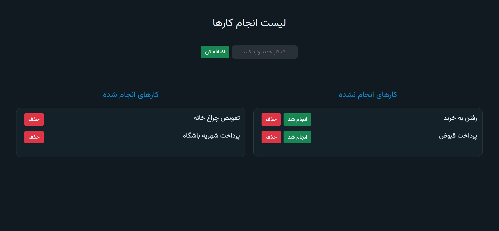
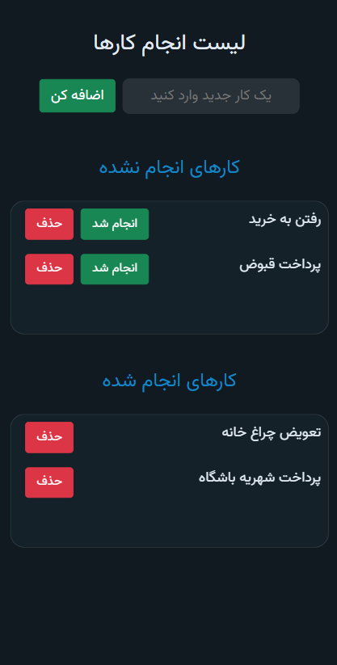

# ✅ لیست کارها / Todo App with Vue 3 and Bootstrap 5

این پروژه یک اپلیکیشن لیست کارهاست که با **Vue 3 (Composition API)** و **Bootstrap 5** ساخته شده و داده‌ها را به طور خودکار در **Local Storage** ذخیره می‌کند.  
This is a **Todo List App** built with **Vue 3 (Composition API)** and **Bootstrap 5**, with automatic saving in **Local Storage**.  

---

## 📸 تصاویر / Screenshots

  
  

---

## ✨ ویژگی‌ها / Features
- افزودن کار جدید با دکمه یا کلید Enter / Add new tasks via input or Enter key  
- حذف کارهای انجام‌نشده و انجام‌شده / Remove pending and completed tasks  
- انتقال کار از لیست انجام‌نشده به انجام‌شده / Move tasks from pending to completed  
- ذخیره‌سازی خودکار در مرورگر / Automatic saving in Local Storage  
- طراحی واکنش‌گرا با Bootstrap 5 / Responsive design with Bootstrap 5  
- افکت شیشه‌ای روی کارت‌ها / Glassmorphism effect on task cards  
- مدیریت فوکوس برای تجربه بهتر / Focus management for better UX  

